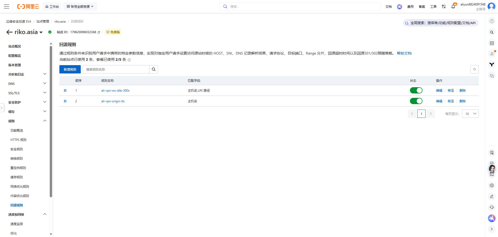

# Ali WS：USB 基线与空闲超时修复

日期：2026-10-08。所有请求时间使用 UTC；客户端时区为 Asia/Singapore。

## 测试路径与版本

正式公网基线：curl → 独立 Windows Mihomo SOCKS `127.0.0.1:17896` → USB Remote NDIS 接口 9 → 固定 ESA IP:443 → `ali.vpn.riko.asia` 的 `/vless-ws` → 现有 Xray → 目标。

外层 SNI 与 Host 均为 `ali.vpn.riko.asia`，关闭独立配置的 TUN 和自动健康检查；清除测试进程代理环境变量，显式使用 SOCKS，不使用 `--noproxy '*'`。外层 TCP 的源地址确认对应 USB 接口地址。测试没有修改用户 Clash 或设备配置。

当前源码基准：Mihomo HEAD `88dcbf7f1614a67c3b36b848ee3592dfa92ada36`，包含本轮前已存在的本地 XHTTP/拨号改动；本轮没有修改核心源码。版本接口返回 `1.10.0`，不能仅用这个字符串复现构建。

Windows 诊断二进制 SHA-256：`00a3ea03f2617304dd952dc7295d3831c127c9f9efbc53d2165d8c00d12cd104`。

Linux 诊断二进制 SHA-256：`8773c024db2b9f57043c1ec3f0611092ccd3cfd2478828d04b4ce42074508f98`。

## 公网证书与建连

DoH 返回的两组测试地址：`163.181.78.189` 与 `163.181.214.9`。它们是测试期间的解析结果，不是固定优选地址。

严格校验结果：SAN 包含 `ali.vpn.riko.asia`；签发者 Let's Encrypt YE2；叶子证书到期时间 `2026-12-21 05:15:15 UTC`；协商 TLS 1.3、ALPN `http/1.1`。本轮未跳过证书校验。

USB A/B 窗口：`07:32:20–07:32:55 UTC`。每组 3 次，交替执行。

| 边缘 IP | 外层指纹 | Google 204 | 总耗时中位数 | 范围 |
|---|---|---|---|---|
| 163.181.78.189 | 默认 | 3/3 | 2.661 秒 | 2.367–2.747 秒 |
| 163.181.78.189 | Chrome | 3/3 | 2.409 秒 | 2.353–3.161 秒 |
| 163.181.214.9 | 默认 | 3/3 | 1.725 秒 | 1.678–2.131 秒 |
| 163.181.214.9 | Chrome | 3/3 | 3.507 秒 | 3.032–3.742 秒 |

所有成功请求 curl 退出码为 0、目标证书校验结果为 0，SOCKS 路径和目标 TLS/响应已确认。耗时包含整个隧道与目标握手，不能当作 ESA 单段 TLS 时延。样本不足以证明某 IP 或指纹普遍更快。

同窗口 ChatGPT、Claude 各一次 curl 请求：TLS 正常，HTTP 403，响应包含 `cf-mitigated: challenge`。没有读取账户资料或提交登录/聊天。该结果不能证明用户正常浏览器同样失败，也不能推定挑战一定来自出口 IP 信誉。

最初 WSL 公网试验默认指纹 0/3、Chrome 1/3，因不能排除宿主 TUN 干扰，不纳入上表。原解析中的 198.18.x.x 为宿主 Fake-IP，不作为边缘地址。

## 空闲问题的前后证据

目标采用自有源站 HTTP/80，同一 HTTP/1.1 连接，读取完整首个 HTTP 200 响应后保持空闲；不在空闲后新建连接。

- 修复前第一次：`07:34:40–07:35:18 UTC`。首个响应 200，声明保持连接，正文 138 字节。空闲 35 秒后下一请求收到 `Remote end closed connection without response`。
- 目标对照：`07:36:04–07:36:45 UTC`。通过 USB 直接 TCP/80，首个响应同为 200/138 字节，40 秒内未收到 EOF。
- 修复前复测：`07:37:38–07:38:11 UTC`。Ali WS 首响应成功后，记录到空闲 **30.000 秒 EOF**。
- 宝塔只读核验：运行中的 `riko-vpn-restore-nginx-1` 挂载配置中 `/vless-ws` 使用 HTTP/1.1 Upgrade，转发 `xray:10080`，`proxy_read_timeout 1h`、`proxy_send_timeout 1h`、`proxy_buffering off`；Xray WS 入站为 10080，无自定义 policy。
- ESA 原规则只针对 Ali Host，设定 HTTPS/443、回源 Host/SNI 为 `vpn.riko.asia`，未设置回源读超时覆盖。

这些结果形成超时假设。新增规则后跨越原阈值的成功结果进一步支持 ESA 回源空闲超时是本轮故障点；没有抓包宣称某一 TCP FIN 的发送方。

## WSL 实际部署与关键功能

窗口：`07:48:21–07:49:35 UTC`。Ubuntu WSL 中使用 Linux Docker CLI、Compose 项目 `riko-ali-ws-timeout`，镜像为恢复的 `riko-vpn-restore-nginx:20261004` 和 `riko-vpn-restore-xray:20261004`。Xray 报告 26.3.27。新建隔离的 edge、xray、dav 容器和测试卷，使用诊断身份，不使用生产身份。

Nginx 语法检查、Xray 配置检查、HTTP 健康请求通过。客户端为独立 Linux Mihomo；本地入口仅绑定回环地址。通过 WS 到专用 WebDAV 目标：

| 模型 | 同一连接空闲 35 秒后 |
|---|---|
| Nginx proxy_read_timeout=30s | 收到连接关闭，复现失败 |
| Nginx proxy_read_timeout=300s | HTTP 200，正文 `ok` |

300 秒模型的 8 MiB 传输：PUT 为 `201 / 8388608`，GET 为 `200 / 8388608`；上传源、下载文件与容器内落盘文件的 SHA-256 均为：

```text
7a0998f1a377beb79e668468097ac073ed09ab995cdc4b1ac4fe561c30097484
```

这是真实本地部署及传输验证，但本地 Nginx 超时模型不等价于 ESA 的全部实现。没有部署新的云端容器或改变源站镜像。

## 云端规则与公网复测

新增启用 `ali-vpn-ws-idle-300s`，只匹配 Ali Host 加 `/vless-ws` 精确路径，将回源读超时设为 300 秒；HTTPS/443 和原 Host/SNI 保持一致。重新打开已保存规则，核对表达式及各字段。免费套餐显示使用 2/5 条回源规则。

复测窗口：`07:52:34–07:53:29 UTC`，通过 USB、`163.181.214.9`、默认指纹：

- Google 204：3/3；curl TLS 校验结果均为 0；总耗时 1.925、2.677、1.628 秒。
- 同一连接首次响应 200/138 字节；空闲 **45 秒** 后再次响应 200/138 字节。



回退：停用新增规则，保留原 TLS 回源规则；回退后按相同 USB 路径复测。原状及新增字段见 `ali-ws-origin-rule-before-20261008.json`。

## 范围与收尾

本轮修复了已复现的约 30 秒空闲断开。没有把 45 秒复测泛化为 300 秒、15 分钟或全天稳定性。云端 8 MiB 上传/下载哈希、Android TUN、平台登录/实际对话均未验收；WSL 的 8 MiB 结果不得替代它们。

各诊断核心已退出，含生产节点身份的本轮临时配置已删除。本轮的独立 Compose 容器、网络与测试卷清理后再次核验。服务器日志级别保持原状，原 Clash、设备应用数据、WARP 配置保持未操作。只修改上述 ESA 规则，未修改订阅或核心。

官方资料：[ESA 网络优化规则](https://help.aliyun.com/zh/edge-security-acceleration/esa/user-guide/network-optimization-rules)、[网络优化](https://help.aliyun.com/zh/edge-security-acceleration/esa/user-guide/network-optimization)、[WS 连接失败排查](https://help.aliyun.com/zh/edge-security-acceleration/esa/support/websocket-connection-failed)。
